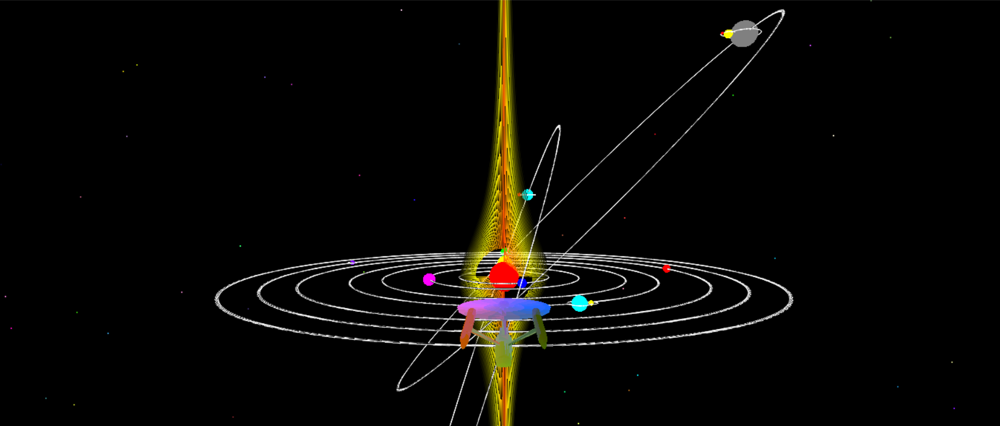

# OpenGL Enigma Solar System

## Overview

OpenGL Enigma Solar System is a 3D graphical simulation of the solar system developed using **OpenGL**. This project visually demonstrates the motion of planets, their orbits, rotations, and relative positions, offering an interactive and visually engaging representation of our solar system. It’s a great example of applying computer graphics concepts such as transformations, lighting, and camera manipulation.

## Project Preview

## Tech Stack

- **Language:** C++  
- **Graphics Library:** OpenGL  
- **API/Frameworks:** GLUT, GLU  
- **Development Tools:** Visual Studio / CodeBlocks / Any C++ IDE  

## Features

- Realistic simulation of planetary orbits and rotations  
- Implementation of scaling, translation, and rotation transformations  
- Lighting effects to simulate the sun’s illumination  
- Camera controls for dynamic viewing angles (if implemented)  
- Modular code structure for easy expansion and experimentation  
